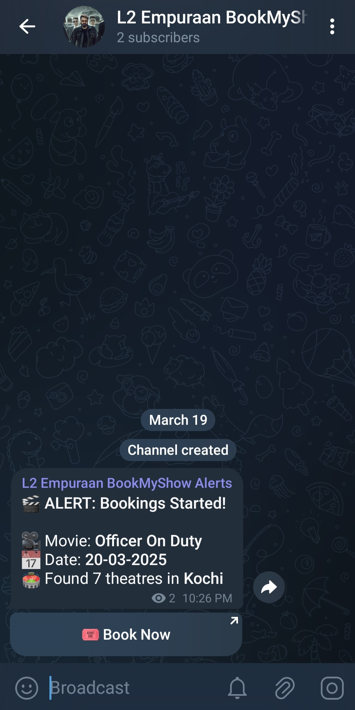

# BookMyShow Bookings Open Telegram Alert System

[L2: Empuraan BookMyShow Alerts Channel](https://t.me/l2e_bms_alerts)

A Go-based web scraper that monitors BookMyShow for when a new movie's bookings open and sends Telegram notifications when bookings open for specified movies.

> **Note:** If you encounter browser auto-download issues during the first run, you might need to manually download it, refer to the [Rod documentation](https://go-rod.github.io/#/compatibility) for browser compatibility troubleshooting.

## Overview

Get notified when new movie bookings open up.

The system:
- Periodically checks BookMyShow for booking availability using cron
- Sends immediate Telegram notifications when bookings open
- Provides direct booking links in notifications
- Supports multiple movies and cities through a simple JSON configuration

## Prerequisites

- Go 1.24.1 or higher
- Telegram Bot Token and Chat ID(for sending notifications)

## How to Setup

1. Install Go:
```bash
# The following is for Ubuntu
wget https://go.dev/dl/go1.24.1.linux-amd64.tar.gz
sudo rm -rf /usr/local/go
sudo tar -C /usr/local -xzf go1.24.1.linux-amd64.tar.gz

# Add Go to your PATH
echo 'export PATH=$PATH:/usr/local/go/bin' >> ~/.profile
echo 'export GOPATH=$HOME/go' >> ~/.profile
echo 'export PATH=$PATH:$GOPATH/bin' >> ~/.profile

source ~/.profile

# Verify installation
go version
```

2. Clone the repository:
```bash
git clone https://github.com/thegeorgenikhil/l2-empuraan-bms-scraper

cd l2-empuraan-bms-scraper
```

3. Install dependencies:
```bash
go mod download
```

4. Set up environment variables:
```bash
cp .env.example .env
# Edit .env with your Telegram bot token and chat ID
```

5. Set up the cron job using crontab:
```bash
crontab -e

# Runs the script every 2 minutes
*/2 * * * * cd path/to/l2-empuraan-bms-scraper && /bin/bash run.sh

# The project already logs to bms.log, but you can redirect cron output here as well to debug any cron-related issues using this command:
*/2 * * * * cd path/to/l2-empuraan-bms-scraper && /bin/bash run.sh >> path/to/l2-empuraan-bms-scraper/bms.log 2>&1
```

## Configuration

### Movie Configuration (bms.json)
Movies are configured in `bms.json`. Each movie entry contains:
```json
{
    "name": "Movie Name",
    "slug_name": "movie-name-slug",
    "code": "ET00XXXXX",
    "city": "city-name",
    "city_code": "city-code",
    "date": "YYYYMMDD",
    "found": false
}
```

### How to Add New Movies

1. Visit the movie's BookMyShow page (e.g., https://in.bookmyshow.com/kochi/movies/officer-on-duty/ET00431676)
2. Extract the following information:
   - Movie code (ET00XXXXX) from the URL
   - Get the city name and code from any released movie's book ticket's page
   - Format the date as YYYYMMDD

Example URL structure of the booking page for a released movie:
```
https://in.bookmyshow.com/buytickets/[movie-slug]-[city]/movie-[city-code]-[movie-code]-MT/[date]
```

For example:
```
https://in.bookmyshow.com/buytickets/officer-on-duty-kochi/movie-koch-ET00431676-MT/20250319

- movie-slug: officer-on-duty
- city: kochi
- city-code: koch
- movie-code: ET00431676
- date: 20250319
```

## Usage

1. Configure your movies in `bms.json`
2. Make sure your `.env` file is properly configured
3. Run the script:
```bash
./run.sh
```

The script will:
- Monitor each movie in the configuration
- Send Telegram notifications when bookings open
- Update the `found` status in `bms.json`
- Log all activities to `bms.log`

## Screenshots

